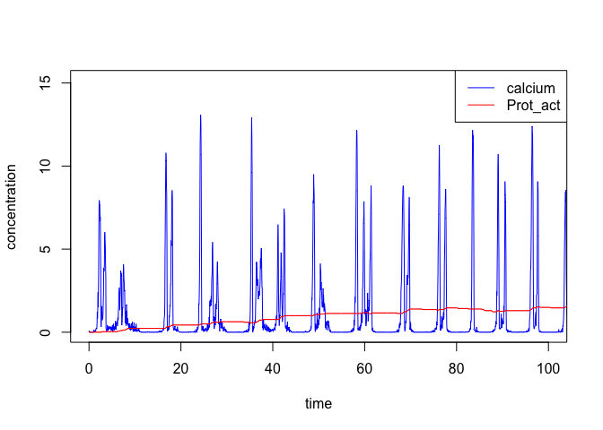

<!-- README.md is generated from README.Rmd. Please edit that file -->
CalciumModelsLibrary
====================

The goal of CalciumModelsLibrary is to provide the user with functions to study the differential activation of calcium-sensitive proteins, such as calmodulin, CaM Kinase II, glycogen phosphorylase and others.

Installation
------------

You can install CalciumModelsLibrary from github with:

``` r
# install.packages("devtools")
devtools::install_github("jpahle/CalciumModelsLibrary")
```

Example
-------

This is a basic example which shows you how to solve a common problem:

``` r
library(CalciumModelsLibrary)
timestep <- 0.05
vol <- 5e-14
f <- 6.0221415e14*vol
k_on <- 0.025
Km <- 1.0
k_off <- 0.005
E0_conc <- 5
h <- 4;
input <- read.table("material/ca5e-14_2.85_1000_0.05s.out", col.names = c("time", "steps", "G_alpha", "PLC", "Ca"))
output <- calmodulin(input$time, input$Ca/f, timestep, vol, k_on, Km, k_off, E0_conc, h)
output <- as.data.frame(output)
colnames(output) <- c("time", "Prot_inact", "Prot_act", "calcium")
plot(output$time, output$calcium, col="blue", xlim=c(0, 100), type="l", xlab="time", ylab="concentration")
lines(output$time, output$Prot_act, col="red", type="l")
legend("topright", legend=c("calcium", "Prot_act"), col=c("blue", "red"), lty=c(1,1))
```


