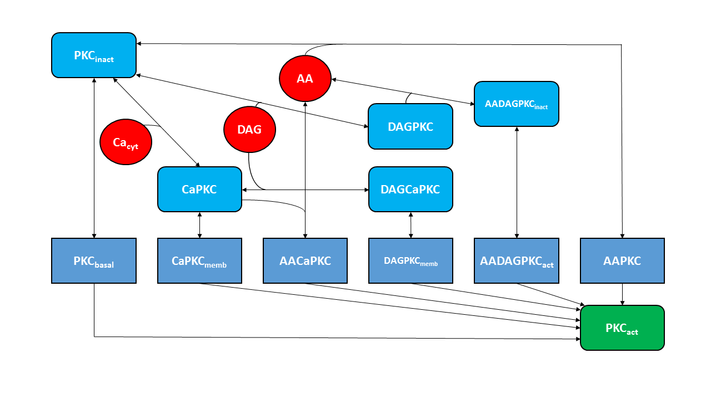

```{r, echo = FALSE}
knitr::opts_chunk$set(collapse = TRUE, comment = "#>")
```

```{r setup, echo = FALSE}
library(CalciumModelsLibrary)
```

## Introduction

This R package contains mathematical models of proteins which are differentially regulated by calcium. 
All implemented models can be simulated stochastically and deterministically via an intuitive interface which allows the user to define both simulation and model-specific parameters as well as the visualization of the simulation output. 

## Simulation Information

Stochastic model files are implemented in C++ and are accessed by R via functions provided by the [Rcpp package](https://cran.r-project.org/web/packages/Rcpp/index.html). The stochastic simulation is handled by a custom implementation of Gillespie's Direct Method (Gillespie, 1976). Therefore, stochastic model files provide propensity equations for all reactions.

Deterministic model files are implemented in R and contain sets of differential equations. They are simulated by the LSODA algorithm (Hindmarsh, 1983) as it is implemented in the [deSolve package](https://cran.r-project.org/web/packages/deSolve/index.html).


## Model Overview {#modeloverview}

The following table provides a quick overview of all models that are implemented in this library. Additional details about each of the models can be found in section [Model Information](#modelinformation)). The model keys can be used to select specific simulation functions: stochastic simulation functions are named "sim_*[MODEL_KEY]*", deterministic simulation functions "*[MODEL_KEY]*_detSim" 

+---------------+---------------+
| Model Key     | References    |
+===============+===============+
| ano           | Jonas Förster\   |
|               | .....................................................................................................................     |
+---------------+---------------+
| calcineurin   | Fisher, W. G., Yang, P.-C., Medikonduri, R. K., and Jafri, M. S. (2006). **NFAT and NFkB Activation in T Lymphocytes: A Model of Differential Activation of Gene Expression**. Annals of Biomedical Engineering 34, 1712–1728.\   |
+---------------+---------------+
| calmodulin    | generic, simple two state test model with non-linear activation (Hill kinetics) and linear deactivation   |
+---------------+---------------+
| camkii        | Dupont, G., Houart, G., and De Koninck, P. (2003). **Sensitivity of CaM kinase II to the frequency of Ca2+ oscillations: a simple model**. Cell Calcium 34(6), 485-497.\   |
+---------------+---------------+
| glycphos      | Gall, D., Baus, E., and Dupont, G. (2000). **Activation of the liver glycogen phosphorylase by Ca(2+)oscillations: a theoretical study**. Journal of Theoretical Biology 207, 445–454.\   |
+---------------+---------------+
| pkc           | Manninen, T., Linne, M.L., and Ruohonen, K. (2006). **Developing Ito stochastic differential equation models for neuronal signal transduction pathways**. Comput Biol Chem 30(4), 280-291.\   |
|               | Intosalmi, J., Manninen, T., Ruohonen, K., and Linne, M. L. (2009). **Modeling protein kinase C activation in the presence of calcium ion fluctuations**. At the Sixth International Workshop on Computational Systems Biology, WCSB 2009, June 10-12, in Aarhus, Denmark. p. 75-78.\     |
|               | Bhalla, U.S. and R. Iyengar. (1999). **Emergent properties of networks of biological signaling pathways**. Science 283(5400), 381-387.     |
+---------------+---------------+


## Use Cases

### 1. Stochastic Simulation of the Calmodulin Model

```{r fig1, fig.height = 5, fig.width = 7, fig.align = "center"}
# Supply simulation parameters as vector
sim_params <- c(timestep = 0.05,
                endTime = 100)
# Supply model parameters as list
model_params <- list(vol = 5e-14,
                     init_conc = c(Prot_inact = 5,
                                   Prot_act = 0))

# Supply a calcium input timeseries file
input_df <- read.table(system.file("extdata/ca5e-14_2.85_1000_0.05s.out", package = "CalciumModelsLibrary"), col.names = c("time", "steps", "G_alpha", "PLC", "Ca"))
f <- 6.0221415e14*model_params[["vol"]]
input_df["Ca"] <- input_df["Ca"]/f

# Stochastically simulate the model
output <- sim_calmodulin(input_df, sim_params, model_params)
output <- as.data.frame(output)

# Plot the output
colnames(output) <- c("time", "calcium", "Prot_inact", "Prot_act")
plot(output$time, output$calcium, col="blue", xlim=c(0, 100), ylim=c(0,15), type="l", xlab="time", ylab="concentration")
lines(output$time, output$Prot_act, col="red", type="l")
legend("topright", legend=c("calcium", "Prot_act"), col=c("blue", "red"), lty=c(1,1))
```

**Detailed Description**

It is mandatory to provide all simulation parameters (timestep and end time), some initial conditions as well as a volume of the model since these parameters have no associated default values in the source code.
Model parameters (reaction rate constants, affinities, etc.) on the other hand can be supplied if the user whishes to overwrite the model specific default values which are defined in the model files.  

Since all implemented models are dependent on calcium as regulator it is necessary to provide a calcium time series as input which can either be a smooth function or a discrete set of (experimentally measured) points. 
In this specific example the number of calcium particles at discrete time points is supplied as a table. Since all simulation functions expect calcium concentration values as input the respective column is divided by the factor $f = volume*N_A$ where $N_A$ is the Avogadro constant.

Folowing the naming convention described above (section [Model Overview](#modeloverview)) the stochastic simulation of the calmodulin model is executed by calling "sim_calmodulin". Afterwards, the simulation output needs to be converted to a data frame object before it can be plotted in typical R fashion.


## Code Structure

There is a fundamental difference in the implementation of stochstic model files compared to deterministic model files. 

**Stochastic Model Files**

All stochastic model files are written in C++ and contain two blocks: the R export options and the model description. 

The R export options section consist of macros which define the model name and include the stochastic simulation function. Additionally a function is defined which checks user supplied parameters and runs the simulation. This wrapper function is named sim_*[MODEL_KEY]* for all models and is exported to R via Rcpp.

The model description includes three functions which define model specific properties: 

- *init*: defines and returns an array of default values for all model parameters 
- *calculate_amu*: contains all propensity equations and saves the cumulative propensities in a vector 
- *update_system*: given a reaction index (rIndex) updates the system state by instantiating the chosen reaction according to the stoichiometry

**Deterministic Model Files**

The deterministic model files are written in R exclusively and contain a function which is named *[MODEL_KEY]*_detSim for all models. 
This function describes the model by defining the set of differential equations, prepares the calcium input by converting it to events and runs the simulation by calling the lsoda function of the deSolve package. 


## Model Information {#modelinformation}

### Ano1 ()

Parameter Values (with references):

### Calcineurin

No changes from source paper.

Parameter Values (with references):

### Calmodulin

generic two-state model created by Dr. Jürgen Pahle, BIOQUANT, University of Heidelberg

### CamKII (Ca^2+^-calmodulin kinase II)

Changes from source paper?

Parameter Values (with references):

### Glycogen Phosphorylase

No changes from source paper.

Parameter Values (with references):

### PKC (Protein Kinase C)

Additional information about the pkc model can be found in this vignette, written by Arne Schoch.

#### <a name="General_header"></a> General information
The presented model is a reproduction of the PKC-model presented in [1] and [2]. In turn, the mentioned publications refer to an older publication by Bhalla and Iyengar [3] in which the model was outlined and who originally defined it. Most parameters including initial concentrations of biochemical species that were used in all of the indicated publications can be found in the DOQCS-database (Database of Quantitative Cellular Signaling) [4]. 

The model displays the activation of protein kinase C via complexation with three effector molecules: $AA$, $Ca_{cyt}$ and $DAG$ (the inputs). As a result different active complexes arise. Besides these complexes there is also a basal PKC-fraction modelled that represents a PKC-activity independent of complexation. Importantly, the model is not specific for a certain PKC-isoform but describes the activation of all available PKC-isoforms in a hippocampal neuron [3]. 

The output of the model ($PKC_{act}$) is composed of the summed up concentrations of all of the active species at a certain point in time. The species that are used for the calculation of $PKC_{act}$ are marked with an asterisk (*) in the publications [1, 2] and explicitly labelled in the attached [glossary](#Glossary_header).                                 

By default, a simple sine input is defined for $Ca_{cyt}$ with a baseline concentration level of 200 nM, a peak concentration level of 1000 nM and a period length of 100 s. The other two input species ($AA$ and $DAG$) are set to fixed concentrations as previously shown in [2]. In another publication sine curves were assigned for $AA$ and $DAG$ [1].

```{r, out.width = "700px", echo = FALSE}

```
*PKC activation model according to [3]. The model consists of ten reversible reactions with three input species (red circles). The summed up concentrations of the species in rectangles without round corners (active PKC-forms) equal the model output PKCact.*    

#### <a name="Limitations-header"></a> Model limitations and assumptions
As mentioned before, it has to be kept in mind that the presented PKC-model does not distinguish between specific PKC-isoforms. Therefore, it has to be understood as a general PKC-model.                                                                                       
The model was fitted to experimental concentration-effect curves found in two publications [5. 6]. Hence, adaptions of single parameters to a modified version of the PKC-model have to be handled with care due to possible parameter non-identifiabilities. 


#### <a name="Reactions&kinetics_header"></a> Reactions and kinetics
|  | Reaction                                      | Reaction formula |
|----------|--------------------------------------------------|------------------|
| $R_1$       | $PKC_{inact} \rightarrow PKC_{basal}$       |  $v_1 = \ k_1 * [PKC_{inact}]$               |
| $R_2$       | $PKC_{basal} \rightarrow PKC_{inact}$        |  $v_2 =  \ k_2 * [PKC_{basal}]$                |
| $R_3$       | $PKC_{inact} + AA \rightarrow AAPKC$                | $v_3 =  \ k_3 * [PKC_{inact}] * [AA]$               |
| $R_4$       | $AAPKC \rightarrow PKC_{inact} + AA$         | $v_4 = \ k_4 * [AAPKC]$                 |
| $R_5$       | $CaPKC \rightarrow CaPKC_{memb}$             |  $v_5 = \ k_5 * [CaPKC]$                |
| $R_6$       | $CaPKC_{memb} \rightarrow CaPKC$             | $v_6 = \ k_6 * [CaPKC_{memb}]$                 |
| $R_7$       | $CaPKC + AA \rightarrow AACaPKC$                      |  $v_7 = \ k_7 * [CaPKC] * [AA]$                |
| $R_8$       | $AACaPKC \rightarrow AA + CaPKC$            |  $v_8 = \ k_8 * [AACaPKC]$              |
| $R_9$       | $DAGCaPKC \rightarrow DAGPKC_{memb}$         |  $v_9 = \ k_9 * [DAGCaPKC]$                |
| $R_{10}$      | $DAGPKC_{memb} \rightarrow DAGCaPKC$         | $v_{10} = \ k_{10} * [DAGPK_{memb}]$               |
| $R_{11}$      | $AADAGPKC_{inact} \rightarrow AADAGPKC_{act}$  | $v_{11} = \ k_{11} * [AADAGPKC_{inact}]$                 |
| $R_{12}$      | $AADAGPKC_{act} \rightarrow AADAGPKC_{inact}$ | $v_{12} = \ k_{12} * [AADAGPKC_{act}]$                 |
| $R_{13}$      | $PKC_{inact} + Ca_{cyt}\rightarrow CaPKC$           | $v_{13} = \ k_{13} * [PKC_{inact}] * [Ca_{cyt}]$                 |
| $R_{14}$      | $CaPKC \rightarrow PKC_{inact} + Ca_{cyt}$       | $v_{14} = \ k_{14} * [CaPKC]$                 |
| $R_{15}$      | $CaPKC + DAG \rightarrow DAGCaPKC$                     |  $v_{15} = \ k_{15} * [CaPKC] * [DAG]$                |
| $R_{16}$      | $DAGCaPKC \rightarrow CaPKC + DAG$           | $v_{16} = \ k_{16} * [DAGCaPKC]$                 |
| $R_{17}$      | $PKC_{inact} + DAG \rightarrow DAGPKC$                | $v_{17} = \ k_{17} * [PKC_{inact}] * [DAG]$                 |
| $R_{18}$      | $DAGPKC \rightarrow PKC_{inact} + DAG$        | $v_{18} = \ k_{18} * [DAGPKC]$                 |
| $R_{19}$      | $DAGPKC + AA \rightarrow AADAGPKC$                    | $v_{19} = \ k_{19} * [DAGPKC] * [AA]$                 |
| $R_{20}$      | $AADAGPKC \rightarrow DAGPKC + AA$             | $v_{20} = \ k_{20} * [AADAGPKC]$                |

#### <a name="Parameters_header"></a> Default Parameters
| Parameter             |   Value  |   Unit   |                                         Comment                                        | Source |
|-----------------------|:--------:|:--------:|:--------------------------------------------------------------------------------------:|:------:|
| $k_1$                    |     $1$    |   $s^{-1}$   | rate constant for $R_1$ (transformation of $PKC_{inact}$ to $PKC_{basal}$)                        |   [4]  |
| $k_2$                    |    $50$    |    $s^{-1}$   | rate constant for $R_2$ (transformation of $PKC_{basal}$ to ${PKC_inact}$)                        |   [4]  |
| $k_3$                    | $1.2 * 10^{-7}$ | $nM^{-1} s^{-1}$ | rate constant for $R_3$ (complexation of $PKC_{inact}$ and $AA$)                                |   [4]  |
| $k_4$                    |   $0.1$   |    $s^{-1}$   | rate constant for $R_4$ (collapse of $AAPKC$ into $PKC_{inact}$ and $AA$)                         |   [4]  |
| $k_5$                    |  $1.2705$  |    $s^{-1}$   | rate constant for $R_5$ (transformation of $CaPKC$ to $CaPKC_{memb}$)                            |   [4]  |
| $k_6$                   |  $3.5026$  |    $s^{-1}$   | rate constant for $R_6$ (transformation of $CaPKC_{memb}$ to $CaPKC$)                            |   [4]  |
| $k_7$                    | $1.2 * 10^{-6}$ | $nM^{-1} s^{-1}$ | rate constant for $R_7$ (complexation of $CaPKC$ and $AA$)                                    |   [4]  |
| $k_8$                    |    $0.1$   |    $s^{-1}$   | rate constant for $R_8$ (collapse of $AACaPKC$ into $CaPKC$ and $AA$)                           |   [4]  |
| $k_9$                    |     $1$    |    $s^{-1}$   | rate constant for $R_9$ transformation of $DAGCaPKC$ to $DAGPKC_{memb}$)                         |   [4]  |
| $k_{10}$                   |    $0.1$   |    $s^{-1}$   | rate constant for $R_{10}$ (transformation of $DAGPKC_{memb}$ to $DAGCaPKC$)                       |   [4]  |
| $k_{11}$                   |     $2$    |    $s^{-1}$   | rate constant for $R_{11}$ (transformation of $AADAGPKC_{inact}$ to $AADAGPKC_{act}$)               |   [4]  |
| $k_{12}$                   |    $0.2$   |    $s^{-1}$   | rate constant for $R_{12}$ (transformation of $AADAGPKC_{act}$ to $AADAGPKC_{inact}$)               |   [4]  |
| $k_{13}$                   |  $0.0006$  | $nM^{-1} s^{-1}$ | rate constant for $R_{13}$ (complexation of $PKC_{inact}$ and $Ca_{cyt}$)                           |   [4]  |
| $k_{14}$                   |    $0.5$   |    $s^{-1}$   | rate constant for $R_{14}$ (collapse of $CaPKC$ into $PKC_{inact}$ and $Ca_{cyt}$)                    |   [4]  |
| $k_{15}$                   | $7.998 * 10^{-6}$ | $nM^{-1} s^{-1}$ | rate constant for $R_{15}$ (complexation of $CaPKC$ and $DAG$)                                  |   [4]  |
| $k_{16}$                   |  $8.6348$  |    $s^{-1}$   | rate constant for $R_{16}$ (collapse of $DAGCaPKC$ into $CaPKC$ and $DAG$)                        |   [4]  |
| $k_{17}$                   | $6 * 10^{-7}$ | $nM^{-1} s^{-1}$ | rate constant for $R_{17}$ (complexation of $PKC_{inact}$ and $DAG$)                              |   [4]  |
| $k_{18}$                   |    $0.1$   |    $s^{-1}$   | rate constant for $R_{18}$ (collapse of $DAGPKC$ into $PKC_{inact}$ and $DAG$)                      |   [4]  |
| $k_{19}$                   | $1.8 * 10^{-5}$ | $nM^{-1} s^{-1}$ | rate constant for $R_{19}$ (complexation of $DAGPKC$ and $AA$)                                  |   [4]  |
| $k_{20}$                   |     $2$    |    $s^{-1}$   | rate constant for $R_{20}$ (collapse of $AADAGPKC$ into $DAGPKC$ and $AA$)                        |   [4]  |
| $[AA]_0$             | $11000$ |    $nM$    | initial concentration for $AA$ (in this version $AA$ is set to a constant concentration)   |   [2]  |
| $[AACaPKC]_0$        | $1.75 * 10^{-13}$ |    $nM$    | initial concentration for $AACaPKC$                                                      |   [4]  |
| $[AADAGPKC_{inact}]_0$ | $2.5188 * 10^{-16}$ |    $nM$    | initial concentration for $AADAGPKC_{inact}$                                               |   [4]  |
| $[AADAGPKC_{act}]_0$   | $4.9137 * 10^{-15}$ |    $nM$    | initial concentration for $AADAGPKC_{act}$                                                 |   [4]  |
| $[AAPKC]_0$          | $1.8133 * 10^-{14}$ |    $nM$    | initial concentration for $AAPKC$                                                        |   [4]  |
| $[CaPKC]_0$          | $3.7208 * 10^{-14}$ |    $nM$    | initial concentration for $CaPKC$                                                        |   [4]  |
| $[CaPKC_{memb}]_0$      | $1.3896 * 10^{-14}$ |    $nM$    | initial concentration for $CaPKC_{memb}$                                                    |   [4]  |
| $[DAG]_0$            |   $5000$   |    $nM$    | initial concentration for $DAG$ (in this version $DAG$ is set to a constant concentration) |   [2]  |
| $[DAGCaPKC]_0$       | $8.4632 * 10^{-20}$ |    $nM$    | initial concentration for $DAGCaPKC$                                                     |   [4]  |
| $[DAGPKC]_0$         | $1.161 * 10^{-13}$ |    $nM$    | initial concentration for $DAGPKC$                                                       |   [4]  |
| $[DAGPKC_{memb}]_0$     | $9.4352 * 10^{-18}$ |    $nM$    | initial concentration for $DAGPKC_{memb}$                                                   |   [4]  |
| $[PKC_{basal}]_0$      |    $20$    |    $nM$    | initial concentration for $PKC_{basal}$                                                    |   [4]  |
| $[PKC_{inact}]_0$      |   $1000$   |    $nM$    | initial concentration for $PKC_{inact}$                                                    |   [4]  |
| $vol$                   | $1 * 10^{-15}$ |     $L$    | cytosol volume value was used for simulations in the indicated paper                   |   [1]  |

#### <a name="Glossary_header"></a> Glossary
| Term           | Explanation                                                                                                                        |
|----------------|------------------------------------------------------------------------------------------------------------------------------------|
| $AA$             | Arachidonic acid                                                                                                                   |
| $AACaPKC$        | Complex of arachidonic acid, cytosolic calcium and protein kinase C (active PKC-form)                                              |
| $AADAGPKC_{inact}$ | Complex of arachidonic acid, diacyl-glycerol and protein kinase C (declared inactive)                                              |
| $AADAGPKC_{act}$   | Complex of arachidonic acid, diacyl-glycerol and protein kinase C (active PKC-form)                                                |
| $AAPKC$          | Complex of arachidonic acid and protein kinase C (active PKC-form)                                                                 |
| $Ca_{cyt}$         | Cytosolic calcium                                                                                                                  |
| $CaPKC$          | Complex of cytosolic calcium and protein kinase C                                                                                  |
| $CaPKC_{memb}$      | Complex of cytosolic calcium, protein kinase C bound to a membrane inside of the cytosol (active PKC-form)                         |
| $DAG$            | Diacyl-glycerol                                                                                                                    |
| $DAGCaPKC$       | Complex of diacyl-glycerol, cytosolic calcium and protein kinase C                                                                 |
| $DAGPKC$         | Complex of diacyl-glycerol and protein kinase C                                                                                    |
| $DAGPKC_{memb}$     | Complex of diacyl-glycerol and protein kinase C bound to a membrane inside of the cytosol (active PKC-form)                        |
| $PKC_{act}$        | The active fraction of protein kinase C (the sum of all the active species)                                                        |
| $PKC_{basal}$      | A species representing the basal activity of protein kinase C that is independent of complexation with effectors (active PKC-form) |
| $PKC_{inact}$      | Inactive protein kinase C that can be transformed to an active form                                                                |


#### <a name="References_header"></a> References

* [1] Manninen, T., M.L. Linne, and K. Ruohonen, __Developing Ito stochastic differential equation models for neuronal signal transduction pathways.__ Comput Biol Chem, 2006. 30(4): p. 280-91.                  
*http://www.ncbi.nlm.nih.gov/pubmed/16880117*

* [2] Intosalmi, J., Manninen, T., Ruohonen, K., Linne, M. J., __Modeling protein kinase C activation in the presence of calcium ion fluctuations.__ At the Sixth International Workshop on Computational Systems Biology, WCSB 2009, June 10-12, 2009 in Aarhus, Denmark. p. 75-78.  
*https://tutcris.tut.fi/portal/fi/publications/modeling-protein-kinase-c-activation-in-the-presence-of-calcium-ion-fluctuations(88c6d7e2-e240-4f25-ae0c-2b259be70332).html*

* [3] Bhalla, U.S. and R. Iyengar, __Emergent properties of networks of biological signaling pathways.__ Science, 1999. 283(5400): p. 381-7.                                      
*http://www.ncbi.nlm.nih.gov/pubmed/9888852*

* [4] Sivakumaran, S., Hariharaputran, S., Mishra, J., Bhalla, U.S., 2003. __The Database of Quantitative Cellular Signaling: management and analysis of chemical kinetic models of signaling networks.__ Bioinformatics 19 (3), 408-415.                                      
*http://doqcs.ncbs.res.in/*

* [5] Schaechter, J.D. and L.I. Benowitz, __Activation of protein kinase C by arachidonic acid selectively enhances the phosphorylation of GAP-43 in nerve terminal membranes.__ J Neurosci, 1993. 13(10): p. 4361-71.                                                             
*http://www.ncbi.nlm.nih.gov/pubmed/8410192*

* [6] Shinomura, T., et al., __Synergistic action of diacylglycerol and unsaturated fatty acid for protein kinase C activation: its possible implications.__ Proc Natl Acad Sci U S A, 1991. 88(12): p. 5149-53.                         
*http://www.ncbi.nlm.nih.gov/pmc/articles/PMC51829/*


